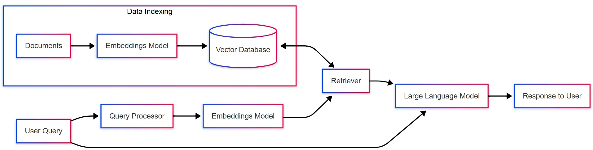
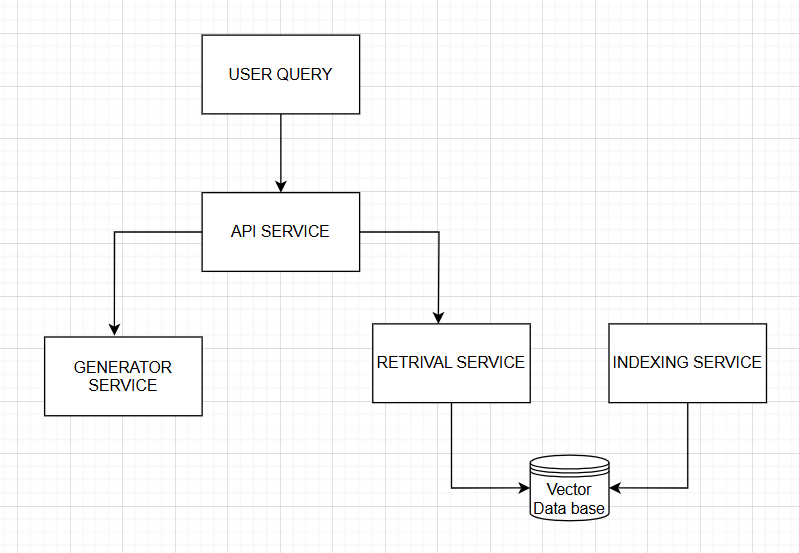

# Kitty Cash Microservices

## Setup

### Prerequisites
- Python 3.10+
- [Ollama](https://ollama.com/) installed and running locally
- Pull a local LLM (LLaMA 3.2 )
  ```bash
  ollama pull llama3.2:latest 
  ```


### Set up data:
- Place your `knowledge_base.txt` in `data/`.
- The FAISS index and docstore.json will be generated automatically.

Each service has its own dependencies. Generally, you should:

### Install Python deps for each service

```bash
pip install -r requirements.txt
```

<<<<<<< HEAD
### Running Services

Start each service:
```bash
uvicorn data_indexing_service.app:app --port 8001
uvicorn retrieval_service.app:app --port 8002
uvicorn generation_service.app:app --port 8003
uvicorn api_server.app:app --port 8000
```

### Always ensure both retrieval and generation services are running before starting or using the API server.


## Architecture



## Overview
- **Data Indexing Service:** Loads kittycash workflows, creates BGE-M3 embeddings, builds FAISS vector indexes.
- **Retrieval Service:** Embeds user queries, searches FAISS index for relevant documents.
- **Generation Service:** Generates responses using local large language model (Llama3) with context.
- **API Service:** Coordinates calls between retrieval and generation services; exposes unified query API.

---

## Architecture


---

## Data Indexing Service

**Purpose:** Load knowledge base documents and index them in FAISS using BGE-M3 embeddings.

**Key Features:**
- Converts text documents to vector embeddings.
- Builds and saves FAISS index and document store.
- REST endpoints for health check, index rebuild, and index status.

---

## Retrieval Service

**Purpose:** Accept user queries, embed with BGE-M3, and search FAISS index for top-k documents.

**Key Features:**
- Loads FAISS index and document store at startup.
- Returns documents and similarity scores.
- REST endpoints for health check and search.

---

## Generation Service

**Purpose:** Format prompt with system rules and context, invoke local LLM, and return generated response.

**Key Features:**
- Enforces chitfund-specific guidelines and privacy rules.
- Uses Ollama to run local LLM model.
- REST endpoints for health check and answer generation.

---

## API  Service

**Purpose:** Provide unified API endpoint, coordinate retrieval and generation calls asynchronously.

**Key Features:**
- Routes user queries to retrieval and generation services.
- Handles errors and logs operations.
- CORS enabled for cross-origin access.

