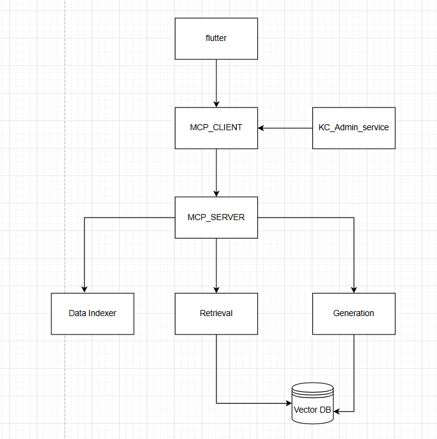

# Kitty Cash Microservices





## Data Indexing Service

A FastAPI microservice that manages **document ingestion, feature detection, embeddings, and FAISS-based indexing** for the KittyCash AI ecosystem.

This service:
- Loads and processes knowledge base (KB) files (`.txt`, `.pdf`, `.csv`, `.xlsx`, `.json`).
- Automatically detects **feature categories** using keyword + embedding similarity.
- Generates **vector embeddings** (BGE / ImageBind models).
- Builds and updates a **FAISS index** for efficient semantic retrieval.
- Exposes REST APIs for health check, indexing, and index status.

##  API Endpoints

| **Method** | **Endpoint** | **Description** |
|-------------|---------------|-----------------|
| **GET** | `/indexing/service/health` | Health check |
| **POST** | `/indexing/index/add` | Upload and index new KB file |
| **GET** | `/indexing/index/status` | Get index version, document count, and dimensions |


---

## Retrieval Service

A FastAPI microservice for **semantic search and intelligent feature-based retrieval** of QnA documents indexed by the KittyCash Data Indexing Service.

This service:
- Loads the **latest FAISS index** and corresponding docstore.
- Detects the **feature/category** of a query using hybrid keyword + embedding logic.
- Retrieves **semantically similar** QnA pairs for user queries.
- Supports two search modes:  
  - `generator` → lightweight response for the AI generator  
  - `admin` → detailed result set for the kc_admin 

##  API Endpoints

| **Method** | **Endpoint** | **Description** |
|-------------|---------------|-----------------|
| **GET** | `/retrieval/service/health` | Health check |
| **GET** | `/retrieval/search/query?query=<text>` | Retrieve top-matching QnAs (for generator use) |
| **GET** | `/retrieval/search/kcadmin?query=<text>` | Retrieve feature-specific QnAs with all matches (for admin use) |

---

## Generation Service

Format prompt with system rules and context, invoke local LLM, and return generated response.

**Key Features:**
- Enforces kittycash specific guidelines and privacy rules.
- Uses Ollama to run local LLM model.
- REST endpoints for health check and answer generation.

##  API Endpoints

| **Method** | **Endpoint** | **Description** |
|-------------|---------------|-----------------|
| **GET** | `/generation/service/health` | Health check |
| **POST** | `/generation/answer/generate` | Generate an AI answer from retrieved context and user query |

---

## KittyCash MCP Server

A FastMCP-powered orchestration layer connecting all core KittyCash microservices:  
**Retrieval**, **Generation**, and **Data Indexing**.  
It exposes unified MCP tools for semantic search, content generation, and index management.


This service:
- Acts as the **central bridge** between AI services.
- Exposes **MCP tools** callable by clients.
- Handles retrieval, generation, and indexing workflows.
- Provides a manifest API for external service discovery.

## API Endpoints

| **Method** | **Endpoint** | **Description** |
|-------------|---------------|-----------------|
| **GET** | `/mcp/tools` | Lists all available MCP tools and their schemas |
| **GET** | `/mcpserver/service/health` | MCP Server health check |

---

##  Available MCP Tools

| **Tool Name** | **Purpose** | **Endpoint Called** |
|----------------|-------------|----------------------|
| `retriever` | Retrieves top-k semantically similar QnAs | `/retrieval/search/query` |
| `retriever_admin_search` | Admin feature-scoped QnA retrieval | `/retrieval/search/kcadmin` |
| `generator` | Generates natural language answers from retrieved context | `/generation/answer/generate` |
| `indexer` | Uploads and indexes KB files | `/indexing/index/add` |
| `indexer_index_status` | Returns index metadata (version, doc count) | `/indexing/index/status` |
| `health` | Aggregated health check for all connected services | `/retrieval/service/health`, `/generation/service/health`, `/indexing/service/health` |

---


## MCP Client
This microservice acts as the **MCP-aware API gateway and orchestrator** between external clients (chatbots, admin UI, or users) and the **KittyCash MCP Server**.  
It intelligently routes user queries, invokes the right tools (retriever, generator, indexer), and returns final AI-generated responses.

This Service:
- Provides REST APIs for **chat**, **KB file upload**, and **admin semantic search**.  
- Uses `KittyCashMCPClient` to communicate with the **MCP Server**.  
- The MCP Client:
  - Discovers available tools from `/mcp/tools`
  - Dynamically routes requests to the correct MCP tool
  - Executes multi-step plans (e.g., retrieval → generation)
  - Integrates with the **Ollama router LLM** for intelligent tool planning 


##  API Endpoints

| **Method** | **Endpoint** | **Description** |
|-------------|---------------|-----------------|
| **GET** | `/health` | Health check for the API server |
| **POST** | `/support/chat` | Handles end-user chat requests and routes them through the MCP pipeline |
| **POST** | `/admin/index/upload` | Uploads and indexes new KB files via MCP |
| **POST** | `/kc_admin/similar-search` | Performs admin-level semantic search using retriever_admin_search |

---

##  Available MCP Client Tools 

| **Tool Name** | **Purpose** | **Underlying MCP Tool Invoked** |
|----------------|-------------|----------------------------------|
| `discover_tools()` | Fetches and caches the MCP tool manifest | `/mcp/tools` |
| `route_and_call()` | Automatically builds and executes retrieval → generation plans for user input | `retriever`, `generator` |
| `retrieve(query)` | Performs vector-based semantic retrieval | `retriever` |
| `generate(user_query, context)` | Generates LLM answers using retrieved context | `generator` |
| `index(kb_file)` | Uploads and indexes KB file through the indexing service | `indexer` |


---
# MCP WORKFLOW


### Kitty Cash Query Workflow

1. **User sends a question** via the API endpoint.

2. **MCP Client** receives the question and asks the **Router LLM** which tools to use.

   - If the question needs facts → Plan: `retriever` → `generator`.
   - If the question is creative → Plan: `generator` only.

3. **MCP Server** executes each tool step:

   - **Retriever:** Searches the FAISS index and returns relevant documents.
   - **Generator:** Takes the query + optional context to produce the final answer using **local LLM (Llama3)**.

4. **Final answer** is returned to the API Service → sent to the user.

If testing in local  first install the requirements and run the each micreservice as mention below: 

### Step 1: Start Data Indexing Service
Generates FAISS index and docstore from the knowledge base:

```bash
uvicorn data_indexing_service.app:app --port 8001 --reload
```
### Step 2: Start Retrieval Service
Searches the FAISS index for relevant documents:
```bash
uvicorn retrieval_service.app:app --port 8002 --reload
```
### Step 3: Start Generation Service
Generates answers using LLaMA 3:
```bash
uvicorn generation_service.app:app --port 8003 --reload
```

### Step 4: Start MCP Server
Executes tool steps  and orchestrates MCP Client:
```bash
python mcp_server.server.py
```

### Step 5: Start Data Indexing Service
Exposes  endpoint to receive user queries and upload files
```bash
uvicorn api_service.app:app --port 8000 --reload
```
### command to test the API service:

```bash
curl -X POST http://127.0.0.1:8000/support/chat \
-H "Content-Type: application/json" \
-d '{
    "user_id": "123",
    "message": "What is Kitty Cash?"
}'
```

### To build docker
```bash
docker-compose up --build
```
### To check logs
```bash
docker compose logs -f 
```

### Check the shared network
```bash
docker inspect kc_admin_service | grep -A 5 "Networks"
```
You should see something like:
```bash
"Networks": {
    "kittycash_cool_network": {
        "IPAMConfig": null,
        "Links": null,
        "Aliases": [
            kc_admin_service
        ]
```

### To list all containers on that shared network:
```bash
docker network inspect kittycash_cool_network | grep Name
```
You should see lines like:
```bash
"Name": "kittycash_db",
"Name": "kittycash_redis",
"Name": "kc_admin_service",
```

